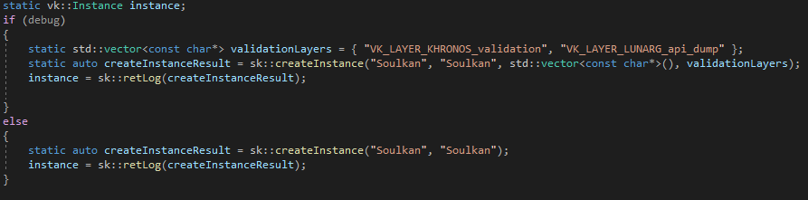

# `Soulkan`

A **powerful** and **concise** library for **simplifying** [Vulkan](https://github.com/KhronosGroup/Vulkan-Headers) and its quirks !
Write a working Hello Triangle program in **under 250 lines**, comments included !
Here, **API** stands for **Abridged Programming Interface** !

# Features

- The more secure [vulkan.hpp](https://github.com/KhronosGroup/Vulkan-Hpp) bindings
- Basic window management with GLFW
- Error communication to the users with the `SkResult` struct template and its related function templates
- A very simple memory allocator
- Its own very simple maths types and (soon) calculations
- Every relevant function is accurately commented, documentaton is indeed included in this single hpp file.

# Goals
- **Simplifying** the Vulkan API
- Making it easier to use **without sacrificing details**
- Improving program **readability**, *a programmer not versed in 3D/GPU Programming should be able to understand what the code does*

## `SkResult` and its related functions

- SkResult is a very simple struct that works as a very lightweight template wrapper around function returns to force error catching.
- `error()` returns a true if the given SkResult contains an error, otherwise returns false
- `returnError()` returns a formatted string containing the given SkResult's informations
- `logError()` returns true and outputs to standard out if the given SkResult contains an error, otherwise returns false and outputs nothing
- `retLog()` the must use function ! Returns the value of the given SkResult and calls `logError()` with the given SkResult 
- More infos in `Soulkan.hpp`

## Examples

- Here is an example of how to create a vulkan instance

## Big thanks to :

- [vkguide](https://vkguide.dev/)
- [vulkan tutorial](https://vulkan-tutorial.com/)

